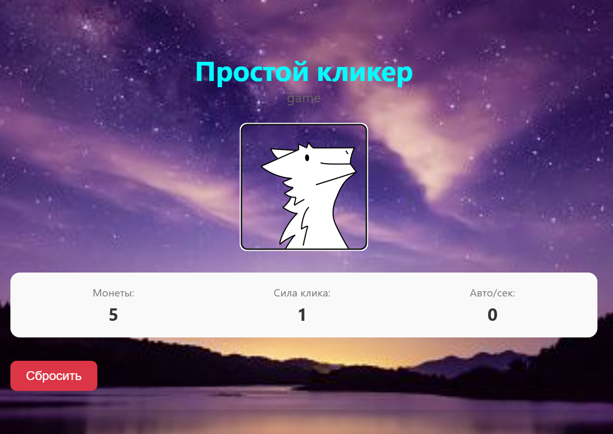
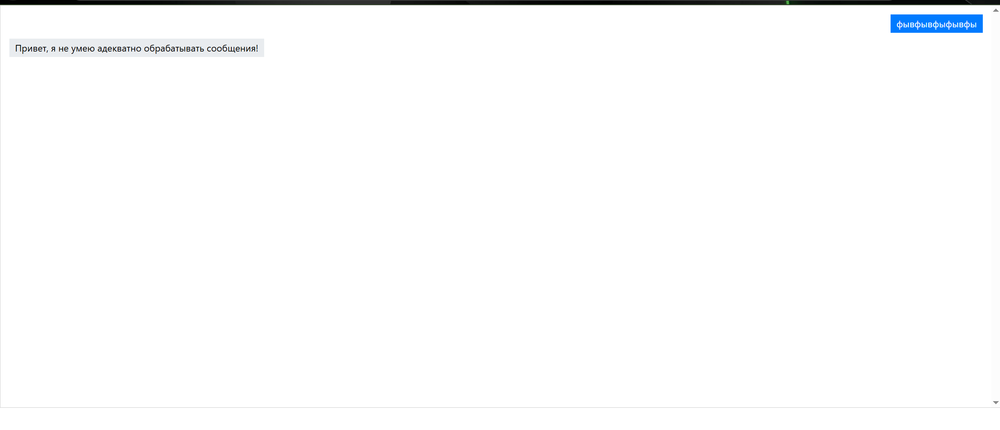
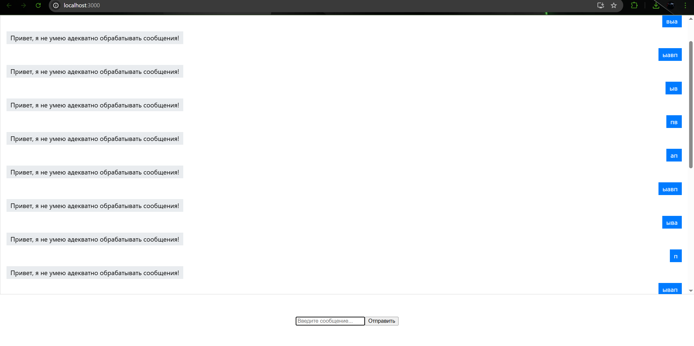

# Простой чат-бот с помощью React

Простой чат-бот (без сервера) — ввод текста и отображение ответа-заглушки.

## Функционал

- Ввод текста через поле ввода.
- Отправление сообщения по нажатию кнопки или клавиши Enter.
- История сообщений

## Скриншоты
### 1. Начальное состояние приложения

### 2. После отправки сообщения

### 3. Он не умеет

### 4. Он много не умеет, но есть скролбар чтоб убедится

